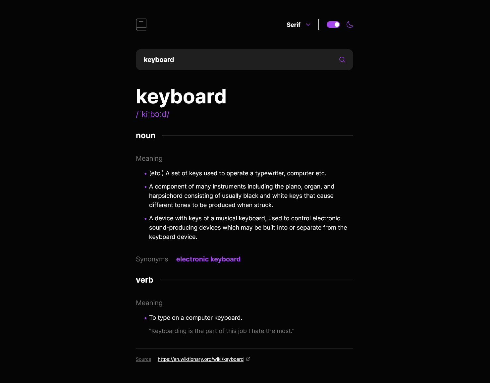

# Frontend Mentor - Dictionary web app solution

This is a solution to the [Dictionary web app challenge on Frontend Mentor](https://www.frontendmentor.io/challenges/dictionary-web-app-h5wwnyuKFL). Frontend Mentor challenges help you improve your coding skills by building realistic projects.

## Table of contents

- [Overview](#overview)
  - [The challenge](#the-challenge)
  - [Screenshot](#screenshot)
  - [Links](#links)
- [My process](#my-process)
  - [Built with](#built-with)
  - [What I learned](#what-i-learned)
  - [Continued development](#continued-development)
  - [Useful resources](#useful-resources)
- [Author](#author)

## Overview

### The challenge

Users should be able to:

- Search for words using the input field
- See the Free Dictionary API's response for the searched word
- See a form validation message when trying to submit a blank form
- Play the audio file for a word when it's available
- Switch between serif, sans serif, and monospace fonts
- Switch between light and dark themes
- View the optimal layout for the interface depending on their device's screen size
- See hover and focus states for all interactive elements on the page
- **Bonus**: Have the correct color scheme chosen for them based on their computer preferences. _Hint_: Research `prefers-color-scheme` in CSS.

### Screenshot

### Links

- [Solution URL](https://github.com/iankakaruzia/dictionary-app)
- [Live Site URL](https://dictionary-app-pied.vercel.app/)

## My process

### Built with

- Semantic HTML5 markup
- TailwindCSS
- Mobile-first workflow
- [React](https://reactjs.org/) - JS library
- [Next.js](https://nextjs.org/) - Using the experimental app directory

### What I learned

This was my first time using the new app directory along side with React Server Components. At the beginning it was a bit confusing there is change in the mental model but after a while I got the hang of it. I also learned how to use the Free Dictionary API.

### Continued development

I would like to continue using the new app directory and learn more about React Server Components.

### Useful resources

- [Next.js Beta Docs](https://beta.nextjs.org/docs/getting-started) - This helped me understanding the concept behind server components and how to use them.

## Author

- Frontend Mentor - [@iankakaruzia](https://www.frontendmentor.io/profile/iankakaruzia)
